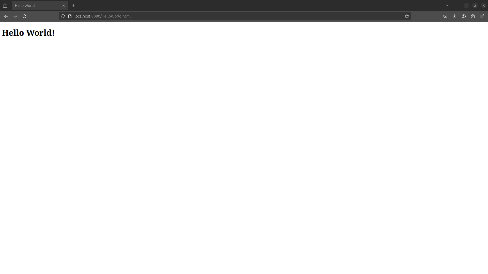
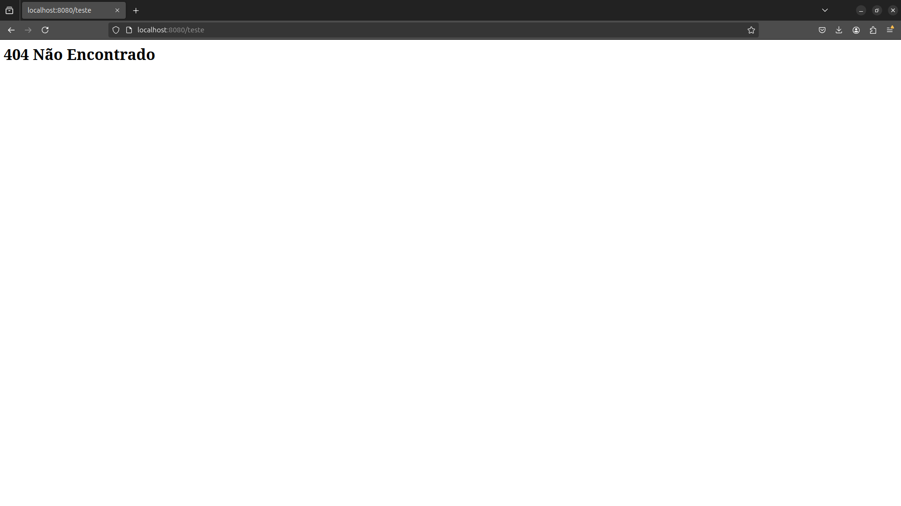
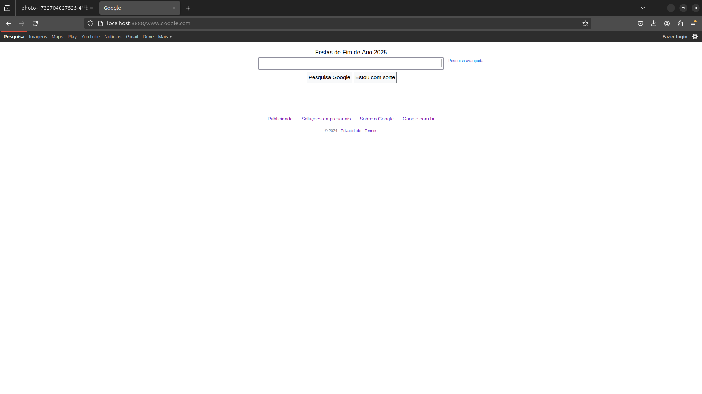

# servidor-web-e-proxy

#### Acessando um arquivo que está no diretório do servidor:

---

#### Tentando obter um arquivo que não está presente no servidor:

---

#### Carregando um site através do servidor proxy:

---

#### Carregando uma imagem através do servidor proxy:

---